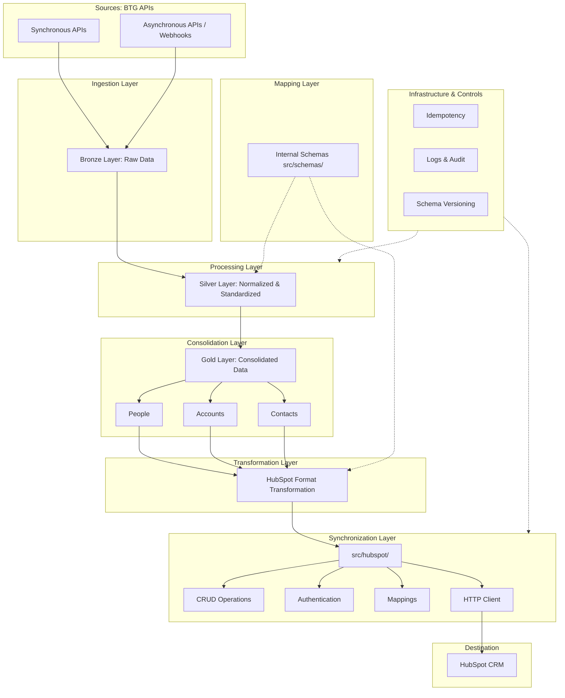

# Workflow Diagram

```mermaid
graph TD
    subgraph Sources["Sources: BTG APIs"]
        SyncAPI[Synchronous APIs]
        AsyncAPI[Asynchronous APIs / Webhooks]
    end

    subgraph Ingestion["Ingestion Layer"]
        Bronze[Bronze Layer: Raw Data]
    end

    subgraph Processing["Processing Layer"]
        Silver[Silver Layer: Normalized & Standardized]
    end

    subgraph Consolidation["Consolidation Layer"]
        Gold[Gold Layer: Consolidated Data]
        People[People]
        Accounts[Accounts]
        Contacts[Contacts]
    end

    subgraph Mapping["Mapping Layer"]
        Schemas[Internal Schemas src/schemas/]
    end

    subgraph Transformation["Transformation Layer"]
        HubSpotFormat[HubSpot Format Transformation]
    end

    subgraph Sync["Synchronization Layer"]
        HubSpotModule[src/hubspot/]
        CRUD[CRUD Operations]
        Auth[Authentication]
        Mappings[Mappings]
        Client[HTTP Client]
    end

    subgraph Destination["Destination"]
        HubSpotCRM[HubSpot CRM]
    end

    %% Flow
    SyncAPI --> Bronze
    AsyncAPI --> Bronze
    Bronze --> Silver
    Silver --> Gold
    
    Gold --> People
    Gold --> Accounts
    Gold --> Contacts

    People --> HubSpotFormat
    Accounts --> HubSpotFormat
    Contacts --> HubSpotFormat

    Schemas -.-> Silver
    Schemas -.-> HubSpotFormat

    HubSpotFormat --> HubSpotModule
    HubSpotModule --> CRUD
    HubSpotModule --> Auth
    HubSpotModule --> Mappings
    HubSpotModule --> Client

    Client --> HubSpotCRM

    %% Infrastructure & Cross-cutting concerns
    subgraph Infrastructure["Infrastructure & Controls"]
        Idempotency[Idempotency]
        Logs[Logs & Audit]
        Versioning[Schema Versioning]
    end

    Infrastructure -.-> Sync
    Infrastructure -.-> Processing
```
