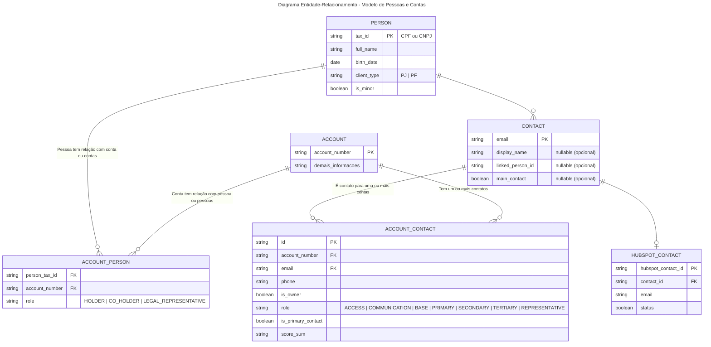

## Diagram ER

```mermaid
---
title: Diagrama Entidade-Relacionamento - Modelo de Pessoas e Contas
---

erDiagram
    ACCOUNT_CONTACT {
        string id PK
        string account_number FK
        string email FK
        string phone
        boolean is_owner
        string role "ACCESS | COMMUNICATION | BASE | PRIMARY | SECONDARY | TERTIARY | REPRESENTATIVE"
        boolean is_primary_contact
        string score_sum
    }

    PERSON {
        string tax_id PK "CPF ou CNPJ"
        string full_name
        date birth_date
        string client_type "PJ | PF"
        boolean is_minor
    }

    ACCOUNT {
        string account_number PK
        string demais_informacoes
    }

    ACCOUNT_PERSON {
        string person_tax_id FK
        string account_number FK
        string role "HOLDER | CO_HOLDER | LEGAL_REPRESENTATIVE"
    }

    CONTACT {
        string email PK
        string display_name "nullable (opcional)"
        string linked_person_id "nullable (opcional)"
        boolean main_contact  "nullable (opcional)"
    }

    HUBSPOT_CONTACT {
        string hubspot_contact_id PK
        string contact_id FK
        string email
        boolean status
    }

    %% Relações
    PERSON ||--o{ ACCOUNT_PERSON : "Pessoa tem relação com conta ou contas"
    ACCOUNT ||--o{ ACCOUNT_PERSON : "Conta tem relação com pessoa ou pessoas"
    
    CONTACT ||--o{ ACCOUNT_CONTACT : "É contato para uma ou mais contas"
    ACCOUNT ||--o{ ACCOUNT_CONTACT : "Tem um ou mais contatos"
    
    CONTACT ||--o| HUBSPOT_CONTACT : ""
    PERSON ||--o{ CONTACT : ""
    

```

