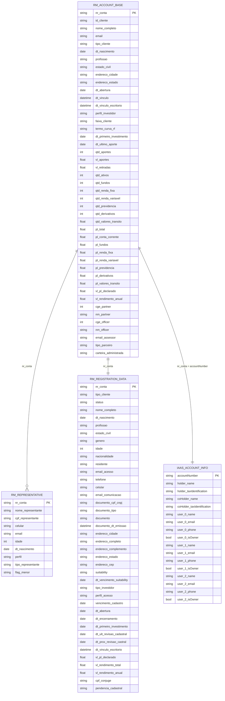

```mermaid
erDiagram

    RM_ACCOUNT_BASE {
        string  nr_conta PK
        string  id_cliente
        string  nome_completo
        string  email
        string  tipo_cliente
        date    dt_nascimento
        string  profissao
        string  estado_civil
        string  endereco_cidade
        string  endereco_estado
        date    dt_abertura
        datetime dt_vinculo
        datetime dt_vinculo_escritorio
        string  perfil_investidor
        string  faixa_cliente
        string  termo_curva_rf
        date    dt_primeiro_investimento
        date    dt_ultimo_aporte
        int     qtd_aportes
        float   vl_aportes
        float   vl_retiradas
        int     qtd_ativos
        int     qtd_fundos
        int     qtd_renda_fixa
        int     qtd_renda_variavel
        int     qtd_previdencia
        int     qtd_derivativos
        float   qtd_valores_transito
        float   pl_total
        float   pl_conta_corrente
        float   pl_fundos
        float   pl_renda_fixa
        float   pl_renda_variavel
        float   pl_previdencia
        float   pl_derivativos
        float   pl_valores_transito
        float   vl_pl_declarado
        float   vl_rendimento_anual
        int     cge_partner
        string  nm_partner
        int     cge_officer
        string  nm_officer
        string  email_assessor
        string  tipo_parceiro
        string  carteira_administrada
    }

    RM_REGISTRATION_DATA {
        string   nr_conta PK
        string   tipo_cliente
        string   status
        string   nome_completo
        date     dt_nascimento
        string   profissao
        string   estado_civil
        string   genero
        int      idade
        string   nacionalidade
        string   residente
        string   email_acesso
        string   telefone
        string   celular
        string   email_comunicacao
        string   documento_cpf_cnpj
        string   documento_tipo
        string   documento
        datetime documento_dt_emissao
        string   endereco_cidade
        string   endereco_completo
        string   endereco_complemento
        string   endereco_estado
        string   endereco_cep
        string   suitability
        date     dt_vencimento_suitability
        string   tipo_investidor
        string   perfil_acesso
        date     vencimento_cadastro
        date     dt_abertura
        date     dt_encerramento
        date     dt_primeiro_investimento
        date     dt_ult_revisao_cadastral
        date     dt_prox_revisao_castral
        datetime dt_vinculo_escritorio
        float    vl_pl_declarado
        float    vl_rendimento_total
        float    vl_rendimento_anual
        string   cpf_conjuge
        string   pendencia_cadastral
    }

    RM_REPRESENTATIVE {
        string  nr_conta PK
        string  nome_representante
        string  cpf_representante
        string  celular
        string  email
        int     idade
        date    dt_nascimento
        string  perfil
        string  tipo_representante
        string  flag_menor
    }

    IAAS_ACCOUNT_INFO {
        string  accountNumber PK
        string  holder_name
        string  holder_taxIdentification
        string  coHolder_name
        string  coHolder_taxIdentification
        string  user_0_name
        string  user_0_email
        string  user_0_phone
        bool    user_0_isOwner
        string  user_1_name
        string  user_1_email
        string  user_1_phone
        bool    user_1_isOwner
        string  user_2_name
        string  user_2_email
        string  user_2_phone
        bool    user_2_isOwner
    }

    RM_ACCOUNT_BASE      ||--o{ RM_REPRESENTATIVE    : "nr_conta"
    RM_ACCOUNT_BASE      ||--|| RM_REGISTRATION_DATA : "nr_conta"
    RM_ACCOUNT_BASE      ||--|| IAAS_ACCOUNT_INFO    : "nr_conta = accountNumber"
```